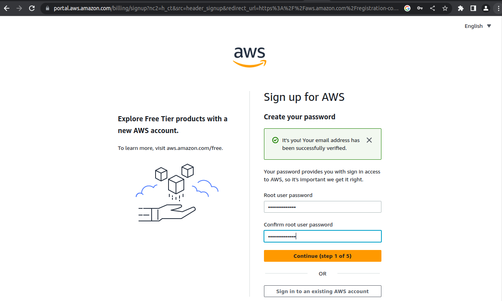
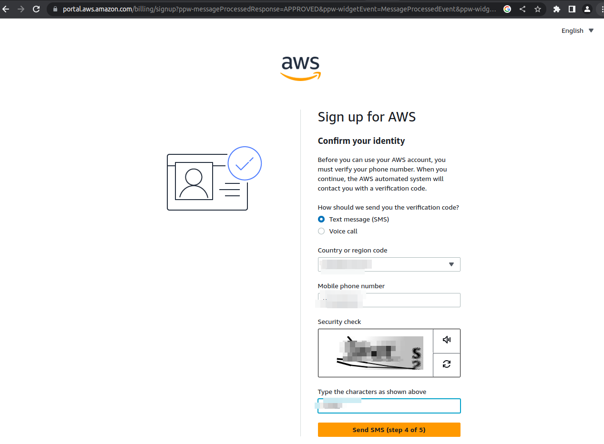
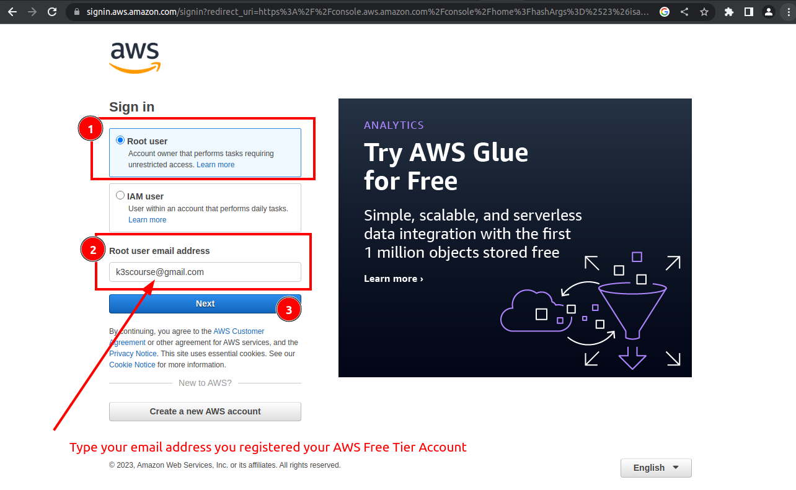
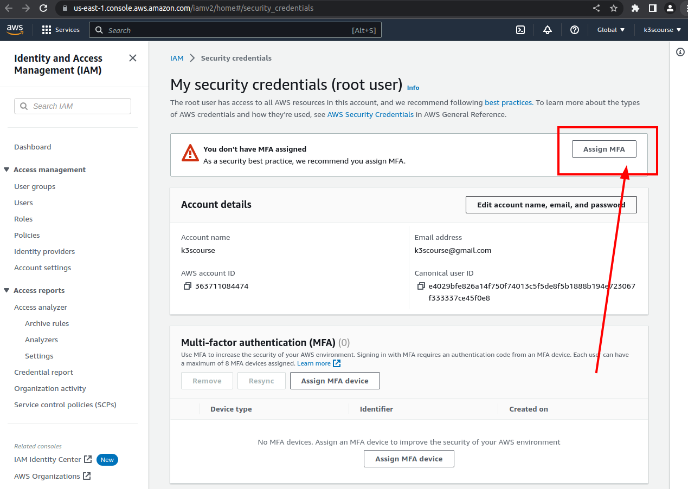
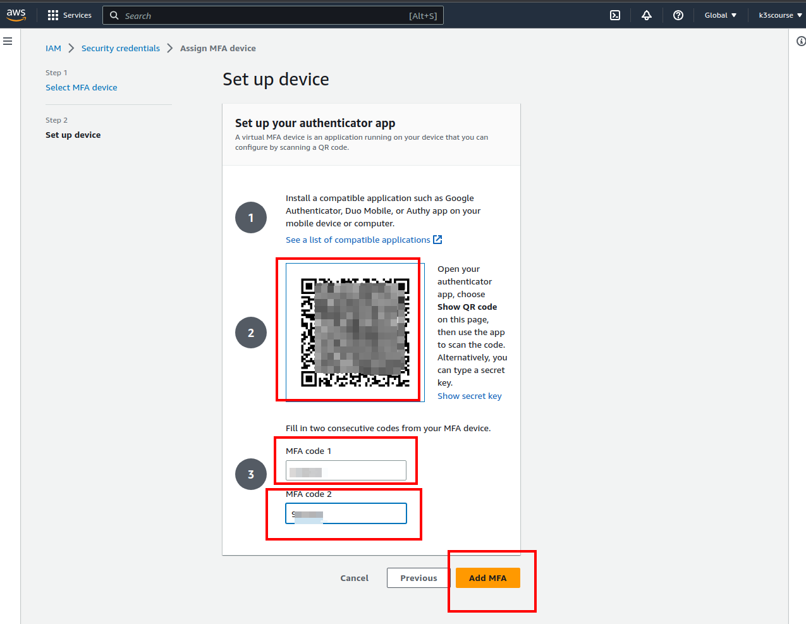
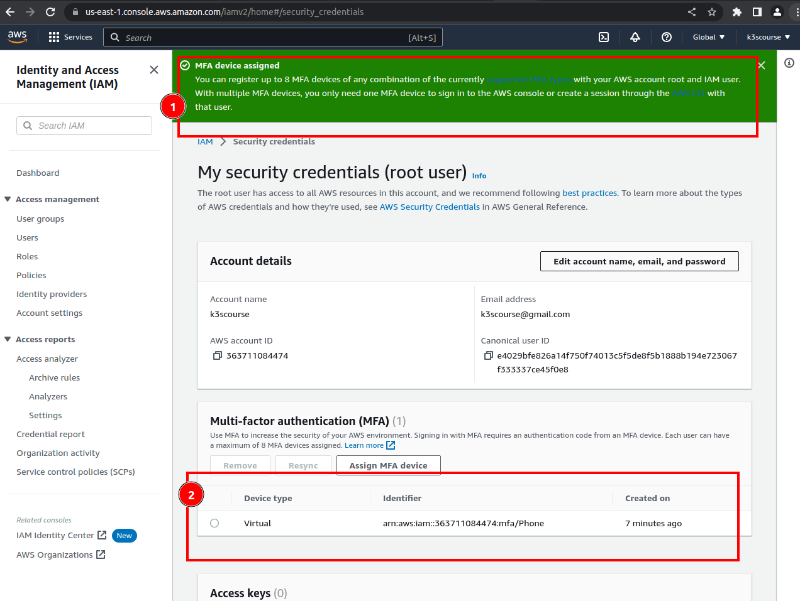

# K3S Udemy course

### Course materials can be found at Github

https://github.com/xjantoth/k3s-udemy-course

### !!! Disclaimer

Make sure to delete all your AWS resources once you are not using it in order to avoid any unexpected charges simply because of forgotten EC2, EBS or any other resources.

### Prerequisites

- install aws, terraform, kubectl, helm binaries
    - Free Coupon from my previous courses on how to setup AWS, and install all required binaries.
    - https://www.udemy.com/course/learn-devops-helm-helmfile-kubernetes-deployment/?couponCode=588B6996050070A30C8F
    - anyone can post a message in case the coupon has been expired and I would forget to update a link here in this repo

- recommend to create a new email address (just for the sake of this Udemy course)
- AWS Free Tier account
- k3scourse@gmail.com (this email is taken by me)
- keep your passwords to AWS safe e.g. keepass
- setup MFA authentication (recommended)
- 3 AWS regions are supported out of a box for AWS Free tier account (Virginia, Oregon, Ohio)
- make sure that datetime is accurate at your workstation

### Setting up AWS Free Tier account

Google "How to create Free Tier AWS account" and use some email address. I would advise to create an email address dedicated for this course.


Verification code will be sent to the respective mailbox once email address was written to a "Sign up for AWS" page


Provide root password. Make sure it is strong enough and save it safely e.g. keepass.


Choose "Personal - for your own projects"


Enter Bank Account data. However, one should not be charged a penny since Free Tier AWS account will be used.


"Text message (SMS)"


Confirm your identity


Choose "Basic support - Free" option.


Congratulations.


Choose "Root user". Sign in with your email address and previoulsy specified password.


Type password.


Setup MFA authentication


Setup MFA authentication


Select MFA device. I would recommend to download "Google Authenticator App" to your cell phone.


Open "Google Authenticator App", hit Plus sign and scan QR code.


You are all set when it comes to so called "root AWS account user"



### Provision EC2 instance in AWS

Generate SSH keys

```bash
ssh-keygen -f ~/.ssh/k3s-course -t rsa -b 4096 -C "k3s-course@udemy.com"

...
Generating public/private rsa key pair.
Enter passphrase (empty for no passphrase):
Enter same passphrase again:
Your identification has been saved in /home/jantoth/.ssh/k3s-course
Your public key has been saved in /home/jantoth/.ssh/k3s-course.pub
The key fingerprint is:
SHA256:ypXf/vfysZNGSExhv01piNjJQux/r/UWrGK3kOeelUQ k3s-course@udemy.com
The key's randomart image is:
+---[RSA 4096]----+
|        ..   o.  |
|        ..+ +.o .|
|        .o =o. E.|
|         o.  oo.o|
|        S . . oo.|
|     . o . o.o.+.|
|      o   .oo.+=o|
|           ++o==*|
|          . =B=**|
+----[SHA256]-----+


# Copy a copy of SSH public key to terraform/ folder
cp ~/.ssh/k3s-course.pub .

```

Check get-caller-identity

```bash
aws sts get-caller-identity --profile k3s-course
{
    "UserId": "AIDAVJLW6W65NFGEHZ3RF",
    "Account": "363711084474",
    "Arn": "arn:aws:iam::363711084474:user/k3s-course-tf"
}

```

Since MFA is enabled we will generate a temporary credentials that Terraform will use when executing `terrafrom apply`.

```bash
# IAM -> choose your IAM user -> Permissions ->   Add Permissions -> Create inline policy -> Json
{
    "Version": "2012-10-17",
    "Statement": [
        {
            "Sid": "MustBeSignedInWithMFA",
            "Effect": "Deny",
            "NotAction": [
                "iam:CreateVirtualMFADevice",
                "iam:DeleteVirtualMFADevice",
                "iam:ListVirtualMFADevices",
                "iam:EnableMFADevice",
                "iam:ResyncMFADevice",
                "iam:ListAccountAliases",
                "iam:ListUsers",
                "iam:ListSSHPublicKeys",
                "iam:ListAccessKeys",
                "iam:ListServiceSpecificCredentials",
                "iam:ListMFADevices",
                "iam:GetAccountSummary",
                "sts:GetSessionToken"
            ],
            "Resource": "*",
            "Condition": {
                "BoolIfExists": {
                    "aws:MultiFactorAuthPresent": "false"
                }
            }
        }
    ]
}
# - - - - - - - - - - - - - - -

# k3s-course-no-mfa-restrictive
{
    "Version": "2012-10-17",
    "Statement": [
        {
            "Sid": "AllowEC2InstanceCreation",
            "Effect": "Allow",
            "Action": [
                "ec2:RunInstances",
                "ec2:DescribeInstances",
                "ec2:TerminateInstances",
                "ec2:CreateTags",
                "ec2:DescribeInstanceTypes",
                "ec2:DescribeLaunchTemplates",
                "ec2:DescribeTags",
                "ec2:DescribeInstanceAttribute",
                "ec2:DescribeVolumes",
                "ec2:DescribeInstanceCreditSpecifications"
            ],
            "Resource": "*"
        },
        {
            "Sid": "AllowKeyPairManagement",
            "Effect": "Allow",
            "Action": [
                "ec2:CreateKeyPair",
                "ec2:DescribeKeyPairs",
                "ec2:DeleteKeyPair",
                "ec2:ImportKeyPair"
            ],
            "Resource": "*"
        },
        {
            "Sid": "AllowSecurityGroupManagement",
            "Effect": "Allow",
            "Action": [
                "ec2:CreateSecurityGroup",
                "ec2:DescribeSecurityGroups",
                "ec2:DeleteSecurityGroup",
                "ec2:RevokeSecurityGroupEgress",
                "ec2:DeleteNetworkInterface",
                "ec2:DescribeNetworkInterfaces",
                "ec2:AuthorizeSecurityGroupIngress",
                "ec2:AuthorizeSecurityGroupEgress",
                "ec2:RevokeSecurityGroupIngress",
                "ec2:StopInstances",
                "ec2:ModifyInstanceAttribute",
                "ec2:StartInstances"
            ],
            "Resource": "*"
        },
        {
            "Sid": "AllowVPCAndAvailabilityZoneManagement",
            "Effect": "Allow",
            "Action": [
                "ec2:DescribeAvailabilityZones",
                "ec2:DescribeVpcAttribute",
                "ec2:DescribeSubnets",
                "ec2:DescribeRouteTables",
                "ec2:DescribeInternetGateways",
                "ec2:DescribeVpcAttribute",
                "ec2:DescribeVpcClassicLink",
                "ec2:DescribeVpcClassicLinkDnsSupport",
                "ec2:DescribeVpcEndpoints",
                "ec2:DescribeVpcEndpointConnectionNotifications",
                "ec2:DescribeVpcEndpointConnections",
                "ec2:DescribeVpcEndpointServiceConfigurations",
                "ec2:DescribeVpcEndpointServicePermissions",
                "ec2:DescribeVpcEndpointServices",
                "ec2:DescribeVpcPeeringConnections",
                "ec2:DescribeVpcs"
            ],
            "Resource": "*"
        },
        {
            "Sid": "AllowBucketListing",
            "Effect": "Allow",
            "Action": [
                "s3:ListBucket",
                "s3:GetBucketLocation"
            ],
            "Resource": "arn:aws:s3:::k3scourse"
        },
        {
            "Sid": "AllowObjectOperations",
            "Effect": "Allow",
            "Action": [
                "s3:PutObject",
                "s3:GetObject",
                "s3:DeleteObject",
                "s3:ListBucketMultipartUploads"
            ],
            "Resource": "arn:aws:s3:::k3scourse/*"
        }
    ]
}


TOKEN_CODE="576353"
token_output=$(aws sts get-session-token \
--serial-number arn:aws:iam::363711084474:mfa/k3s-course-tf \
--token-code ${TOKEN_CODE} \
--profile k3s-course)

# Extract the temporary credentials from the command output
export AWS_ACCESS_KEY_ID=$(echo $token_output | jq -r '.Credentials.AccessKeyId')
export AWS_SECRET_ACCESS_KEY=$(echo $token_output | jq -r '.Credentials.SecretAccessKey')
export AWS_SESSION_TOKEN=$(echo $token_output | jq -r '.Credentials.SessionToken')

export AWS_DEFAULT_PROFILE
# verify that
env | grep AWS

cd terraform/
terraform init
```

### Finding proper AMI imagee

```bash
[arch:terraform master()U] aws ssm get-parameters --names /aws/service/canonical/ubuntu/server/20.04/stable/current/amd64/hvm/ebs-gp2/ami-id
{
    "Parameters": [
        {
            "Name": "/aws/service/canonical/ubuntu/server/20.04/stable/current/amd64/hvm/ebs-gp2/ami-id",
            "Type": "String",
            "Value": "ami-0efd657a42099f98f",
            "Version": 273,
            "LastModifiedDate": "2023-06-03T01:45:16.166000+02:00",
            "ARN": "arn:aws:ssm:us-east-1::parameter/aws/service/canonical/ubuntu/server/20.04/stable/current/amd64/hvm/ebs-gp2/ami-id",
            "DataType": "aws:ec2:image"
        }
    ],
    "InvalidParameters": []
}

```


### Tesing a first deployment via kubectl

```bash
kubectl create deployment k3scourse --image=ghcr.io/benc-uk/python-demoapp:latest --replicas=1 --port 5000
kubectl expose deployment k3scourse --port=8080 --target-port=5000 # --type NodePort

kubectl apply -f - <<EOF
apiVersion: networking.k8s.io/v1
kind: Ingress
metadata:
  name: k3scourse
spec:
  ingressClassName: nginx
  rules:
    - http:
        paths:
          - pathType: Prefix
            path: /
            backend:
              service:
                name: k3scourse
                port:
                  number: 8080
EOF


helm repo add nginx https://kubernetes.github.io/ingress-nginx
helm repo update nginx
helm install nginx nginx/ingress-nginx --set controller.service.nodePorts.http=30111

kubectl apply -f - <<EOF
apiVersion: networking.k8s.io/v1
kind: Ingress
metadata:
  name: minimal-ingress
  annotations:
    nginx.ingress.kubernetes.io/rewrite-target: /$2
spec:
  ingressClassName: nginx
  rules:
  - http:
      paths:
      - path: /app(/|$)(.*)
        pathType: ImplementationSpecific
        backend:
          service:
            name: k3scourse
            port:
              number: 8080
EOF

```

Test that security group allows only port specified via telnet or netcat(nc) commnad

```bash
# run this command at EC3 instance in AWS
nc -l -p 10333

# run this commands locally
telnet 1.2.3.4 10333
telnet 1.2.3.4 80

nc -z -v -w2 1.2.3.4 10333
nc -z -v -w2 1.2.3.4 80

awk '/32 host/ { print f } {f=$2}' <<< "$(</proc/net/fib_trie)"
```
