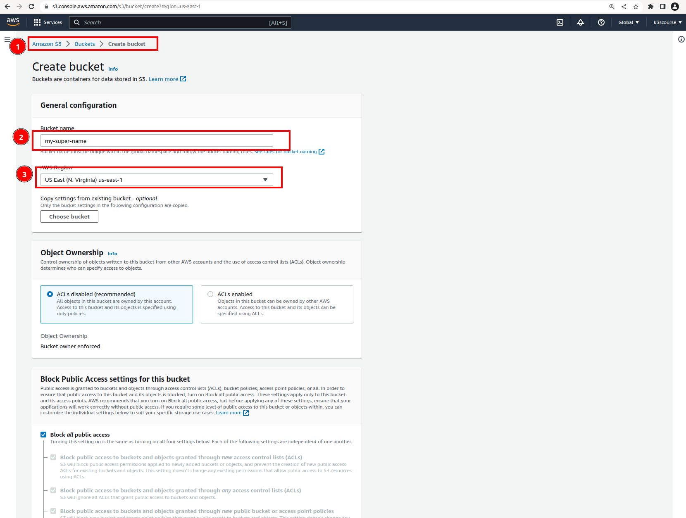

### Create S3 bucket

`Terraform state refers to the information that Terraform uses to track and manage the resources it provisions and manages within an infrastructure.` It is a critical component of Terraform's functionality and helps keep track of the state of the managed infrastructure.

The Terraform state includes:

1. `Resource metadata`: Information about the resources managed by Terraform, such as resource type, ID, attributes, dependencies, and relationships between resources.

2. `Provider information`: Details about the provider used for provisioning the resources, including provider type, version, and configuration.

3. `Input variables and outputs`: The input variables provided to the Terraform configuration and the outputs generated by the Terraform configuration.

The Terraformstate is typically stored in a file, often named `terraform.tfstate`, although it can also be stored remotely using backends like AWS S3

We will need `S3 bucket to store terraform state`.

