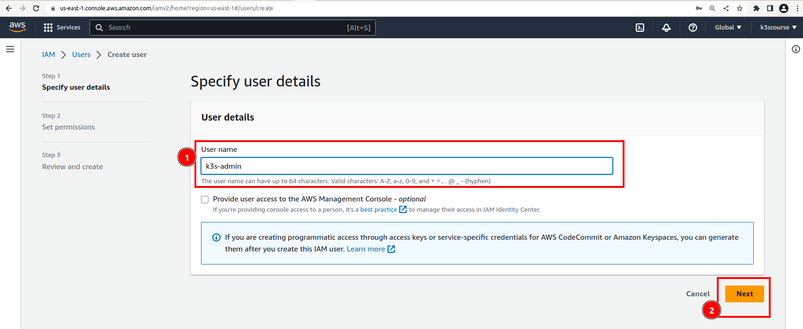

### Create terraform IAM user

Create a new IAM user with MFA and `AdministrationAccess` privileges.
Log in as `Root user` user with your email address and root password.

Open up a mobile app and type in 6-digit code.

Navigate to IAM and click at `Users`` section. Click `Add users` button.

Choose a username e.g. `k3s-admin`

Through `Security Credentials` tab choose `Attach policies directly` and pick `AdministrationAccess`

Create user.

Through `Security Credentials` tab choose `MFA` settings.

Scan bar code and type in 6-digits numbers twice in a row.

Through `Security Credentials` tab choose `Enable console access` settings.

Setup password.

User created. Save password and login URL safely and never share with anyone.

