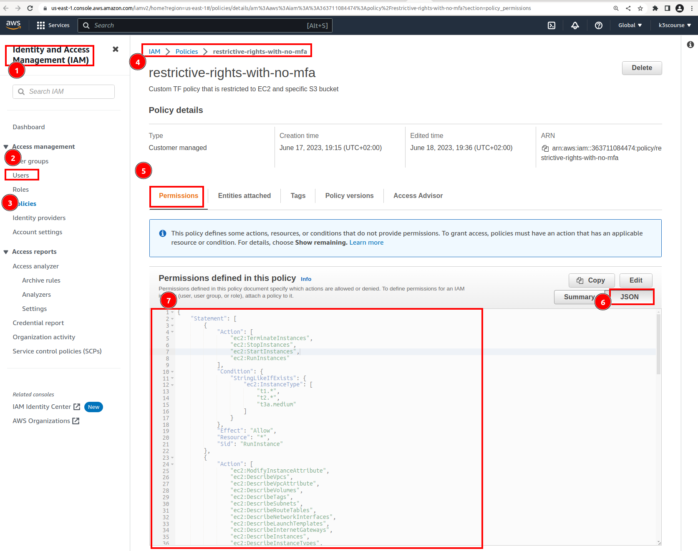

### Create terraform IAM user

#### Create a new use AWS IAM `k3s-restrictive-no-mfa` and hit `Next` button.


Hit `Next`.


Finally, `Create user`.


Navigate to `Security Credentials` section under `k3s-restrictive-no-mfa` IAM user and click to create new `Access key`. Choose `Command Line Interface` and checkbox at the bottom. Finally click `Next`.


Set some `Description tag value`.


Copy `Access key` and `Secret access key`. Download `.csv file` with credentials and never share with anyone.


Check active `Access Keys`


#### Configure AWS CLI profile for `k3s-restrictive-no-mfa` IAM user. The profile name can be anything but for the sake of continuity let's use name: `k3s-restrictive-no-mfa`

```bash
[arch:k3s-udemy-course master()U] aws configure --profile k3s-restrictive-no-mfa
AWS Access Key ID [None]: AK...C
AWS Secret Access Key [None]: HDx....................U
Default region name [None]: us-east-1
Default output format [None]:
```


#### Check configuration files used by `aws` binary:
- `~/.aws/config`
- `~/.aws/credentials`


#### Alternatively, `Access keys` can be created via `root` or whatever user's credentials from


```bash
aws iam create-access-key --user-name k3s-restrictive-no-mfa
```


#### Attache a restrictive IAM policy directly to a `k3s-restrictive-no-mfa` IAM user

Despite the fact that we are using AWS FREE Tier for these learning, it is possible to start EC2 types that do not fall under Free tier. Moreover, it is the best practice to follow least privilege principle and only grant least permissions needed for the code to execute.

Navigate to `IAM` -> `Users` -> `k3s-restrictive-no-mfa` -> `Permissions` -> `Add permissions` -> `Create inline policy`

and copy/paste following IAM policy to JSON section. Assign some policy name e.g. `restrictive-rights-with-no-mfa` Then save all the changes.

```json
{
    "Statement": [
        {
            "Action": [
                "ec2:TerminateInstances",
                "ec2:StopInstances",
                "ec2:StartInstances",
                "ec2:RunInstances"
            ],
            "Condition": {
                "StringLikeIfExists": {
                    "ec2:InstanceType": [
                        "t1.*",
                        "t2.*",
                        "t3a.medium"
                    ]
                }
            },
            "Effect": "Allow",
            "Resource": "*",
            "Sid": "RunInstance"
        },
        {
            "Action": [
                "ec2:ModifyInstanceAttribute",
                "ec2:DescribeVpcs",
                "ec2:DescribeVpcAttribute",
                "ec2:DescribeVolumes",
                "ec2:DescribeTags",
                "ec2:DescribeSubnets",
                "ec2:DescribeRouteTables",
                "ec2:DescribeNetworkInterfaces",
                "ec2:DescribeLaunchTemplates",
                "ec2:DescribeInternetGateways",
                "ec2:DescribeInstances",
                "ec2:DescribeInstanceTypes",
                "ec2:DescribeInstanceCreditSpecifications",
                "ec2:DescribeInstanceAttribute",
                "ec2:DescribeImages",
                "ec2:DescribeAvailabilityZones",
                "ec2:DeleteNetworkInterface",
                "ec2:CreateTags"
            ],
            "Effect": "Allow",
            "Resource": "*",
            "Sid": "AllowEC2Operations"
        },
        {
            "Action": [
                "ec2:ImportKeyPair",
                "ec2:DescribeKeyPairs",
                "ec2:DeleteKeyPair",
                "ec2:CreateKeyPair"
            ],
            "Effect": "Allow",
            "Resource": "*",
            "Sid": "AllowKeyPairOperations"
        },
        {
            "Action": [
                "ec2:RevokeSecurityGroupIngress",
                "ec2:RevokeSecurityGroupEgress",
                "ec2:DescribeSecurityGroups",
                "ec2:DeleteSecurityGroup",
                "ec2:CreateSecurityGroup",
                "ec2:AuthorizeSecurityGroupIngress",
                "ec2:AuthorizeSecurityGroupEgress"
            ],
            "Effect": "Allow",
            "Resource": "*",
            "Sid": "AllowSecurityGroupsOperations"
        },
        {
            "Action": [
                "iam:TagRole",
                "iam:TagInstanceProfile",
                "iam:RemoveRoleFromInstanceProfile",
                "iam:PutRolePolicy",
                "iam:PassRole",
                "iam:ListRolePolicies",
                "iam:ListInstanceProfilesForRole",
                "iam:ListInstanceProfiles",
                "iam:ListAttachedRolePolicies",
                "iam:GetRolePolicy",
                "iam:GetRole",
                "iam:GetInstanceProfile",
                "iam:DeleteRolePolicy",
                "iam:DeleteRole",
                "iam:DeleteInstanceProfile",
                "iam:CreateRole",
                "iam:CreateInstanceProfile",
                "iam:AddRoleToInstanceProfile"
            ],
            "Effect": "Allow",
            "Resource": "*",
            "Sid": "AllowIAM"
        },
        {
            "Action": [
                "ssm:PutParameter",
                "ssm:ListTagsForResource",
                "ssm:GetParameters",
                "ssm:GetParameter",
                "ssm:DescribeParameters",
                "ssm:DeleteParameter",
                "ssm:AddTagsToResource"
            ],
            "Effect": "Allow",
            "Resource": "*",
            "Sid": "AllowSSMOperations"
        },
        {
            "Action": [
                "s3:ListBucket",
                "s3:GetBucketLocation"
            ],
            "Effect": "Allow",
            "Resource": "arn:aws:s3:::k3scourse",
            "Sid": "AllowBucketListing"
        },
        {
            "Action": [
                "s3:PutObject",
                "s3:ListBucketMultipartUploads",
                "s3:GetObject",
                "s3:DeleteObject"
            ],
            "Effect": "Allow",
            "Resource": "arn:aws:s3:::k3scourse/*",
            "Sid": "AllowObjectOperations"
        }
    ],
    "Version": "2012-10-17"
}
```


