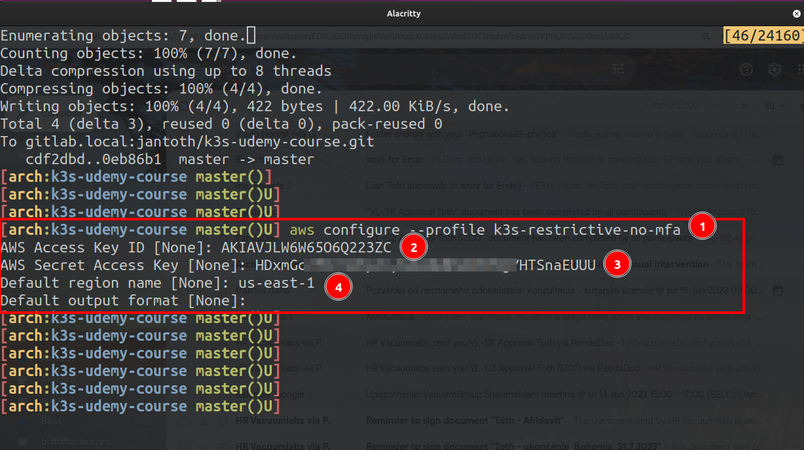

### Create terraform IAM user

Create a new use AWS IAM `k3s-restrictive-no-mfa` and hit `Next` button.


Hit `Next`.


Finally, `Create user`.


Navigate to `Security Credentials` section under `k3s-restrictive-no-mfa` IAM user and click to create new `Access key`. Choose `Command Line Interface` and checkbox at the bottom. Finally click `Next`.


Set some `Description tag value`.


Copy `Access key` and `Secret access key`. Download `.csv file` with credentials and never share with anyone.


Check active `Access Keys`


Configure AWS CLI profile for `k3s-restrictive-no-mfa` IAM user. The profile name can be anything but for the sake of continuity let's use name: `k3s-restrictive-no-mfa`

```bash
[arch:k3s-udemy-course master()U] aws configure --profile k3s-restrictive-no-mfa
AWS Access Key ID [None]: AK...C
AWS Secret Access Key [None]: HDx....................U
Default region name [None]: us-east-1
Default output format [None]:
```



Check configuration files used by `aws` binary:
- `~/.aws/config`
- `~/.aws/credentials`


Alternatively, `Access keys` can be created via `root` or whatever user's credentials from


```bash
aws iam create-access-key --user-name k3s-restrictive-no-mfa
```
