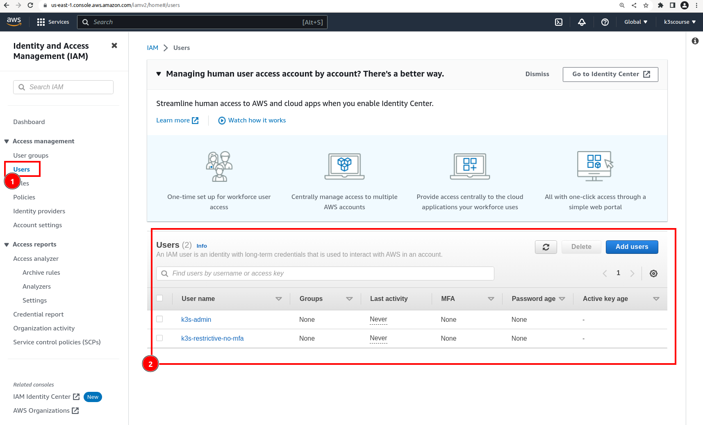

### Demonstrate creation of IAM users via Terraform

This video will be about how to automate almost everything (by Terraform) what has been done manually so far in terms of
crating two IAM users with their respective policies.

Recap:
- k3s-admin (Access Keys (just for MFA demonstration), MFA enabled, `AdministrationAccess`, custom policy `k3s-admin-ui-cli-with-mfa`)
- k3s-restrictive-no-mfa (Access Keys, without MFA, custom policy `restrictive-rights-with-no-mfa`)


1. Log in as `root` IAM user (by using email address + MFA)
2. Navigate to `IAM` section and click at `Users`

#### Delete manually created IAM users


#### Delete custom IAM policies


Custom policies are gone now.


#### Create temporary AWS credentials for root user

1. Click at most upper right corner (AWS account name).
2. Choose `Security credentials` from a drop-down menu.
3. Create CLI `Access Keys`
4. Configure aws cli profile and name it as `k3s-root`
5. Use it just once for creation of IAM users with custom policies
6. Remove root`s `Access Keys` (Never Never Never share them with anyone/Do not push them to Github or anywhere else!!!)


#### Trigger terraform code that created two IAM users

```bash
git clone https://github.com/xjantoth/k3s-udemy-course.git
cd k3s-udemy-course
ls -al

cd tf-root/
ls -al

# Make sure that you have unset all of your AWS variable in a current terminal
unset $(echo $(env | grep AWS | cut -d"=" -f1))
export AWS_DEFAULT_PROFILE=k3s-root
env | grep AWS_DEFAULT_PROFILE
```

#### Modify tf-root/backend.tf and tf-root/main.tf files

Type in your AWS S3 bucket name to:
- [line 10 file tf-root/backend.tf](https://github.com/xjantoth/k3s-udemy-course/blob/master/tf-root/backend.tf#L10)
- [line 13 file tf-root/main.tf](https://github.com/xjantoth/k3s-udemy-course/blob/master/tf-root/main.tf#L13)

Remember that AWS S3 bucket name `k3scourse` is already taken by me :).

Finally, IAM users can be created by Terraform.

```bash
# initialize terrafrom
terraform init
terraform plan
terraform apply


[arch:tf-root master()U] terraform apply
data.aws_iam_policy_document.mfa: Reading...
data.aws_iam_policy_document.restrictive: Reading...
data.aws_iam_policy_document.mfa: Read complete after 0s [id=779724439]
data.aws_iam_policy_document.restrictive: Read complete after 0s [id=4071721818]

Terraform used the selected providers to generate the following execution plan. Resource
actions are indicated with the following symbols:
  + create

Terraform will perform the following actions:

  # aws_iam_policy.mfa will be created
  + resource "aws_iam_policy" "mfa" {
      + arn         = (known after apply)
      + description = "Custom TF policy that enforces MFA at cli level"
      + id          = (known after apply)
      + name        = "k3s-admin-ui-cli-with-mfa"
      + name_prefix = (known after apply)
      + path        = "/"
      + policy      = jsonencode(
            {
              + Statement = [
                  + {
                      + Condition = {
                          + BoolIfExists = {
                              + "aws:MultiFactorAuthPresent" = "false"
                            }
                        }
                      + Effect    = "Deny"
                      + NotAction = [
                          + "sts:GetSessionToken",
                          + "iam:ResyncMFADevice",
                          + "iam:ListVirtualMFADevices",
                          + "iam:ListUsers",
                          + "iam:ListServiceSpecificCredentials",
                          + "iam:ListSSHPublicKeys",
                          + "iam:ListMFADevices",
                          + "iam:ListAccountAliases",
                          + "iam:ListAccessKeys",
                          + "iam:GetAccountSummary",
                          + "iam:EnableMFADevice",
                          + "iam:DeleteVirtualMFADevice",
                          + "iam:CreateVirtualMFADevice",
                        ]
                      + Resource  = "*"
                      + Sid       = "MustBeSignedInWithMFA"
                    },
                ]
              + Version   = "2012-10-17"
            }
        )
      + policy_id   = (known after apply)
      + tags_all    = {
          + "Environment" = "Course"
          + "Name"        = "k3s-course-tf-root"
          + "Owner"       = "Terraform"
          + "Project"     = "Learning"
        }
    }

  # aws_iam_policy.restrictive will be created
  + resource "aws_iam_policy" "restrictive" {
      + arn         = (known after apply)
      + description = "Custom TF policy that is restricted to EC2 and specific S3 bucket"
      + id          = (known after apply)
      + name        = "restrictive-rights-with-no-mfa"
      + name_prefix = (known after apply)
      + path        = "/"
      + policy      = jsonencode(
            {
              + Statement = [
                  + {
                      + Action    = [
                          + "ec2:TerminateInstances",
                          + "ec2:StopInstances",
                          + "ec2:StartInstances",
                          + "ec2:RunInstances",
                        ]
                      + Condition = {
                          + StringLikeIfExists = {
                              + "ec2:InstanceType" = [
                                  + "t1.*",
                                  + "t2.*",
                                  + "t3a.medium",
                                ]
                            }
                        }
                      + Effect    = "Allow"
                      + Resource  = "*"
                      + Sid       = "RunInstance"
                    },
                  + {
                      + Action   = [
                          + "ec2:ModifyInstanceAttribute",
                          + "ec2:DescribeVpcs",
                          + "ec2:DescribeVpcAttribute",
                          + "ec2:DescribeVolumes",
                          + "ec2:DescribeTags",
                          + "ec2:DescribeSubnets",
                          + "ec2:DescribeRouteTables",
                          + "ec2:DescribeNetworkInterfaces",
                          + "ec2:DescribeLaunchTemplates",
                          + "ec2:DescribeInternetGateways",
                          + "ec2:DescribeInstances",
                          + "ec2:DescribeInstanceTypes",
                          + "ec2:DescribeInstanceCreditSpecifications",
                          + "ec2:DescribeInstanceAttribute",
                          + "ec2:DescribeImages",
                          + "ec2:DescribeAvailabilityZones",
                          + "ec2:DeleteNetworkInterface",
                          + "ec2:CreateTags",
                        ]
                      + Effect   = "Allow"
                      + Resource = "*"
                      + Sid      = "AllowEC2Operations"
                    },
                  + {
                      + Action   = [
                          + "ec2:ImportKeyPair",
                          + "ec2:DescribeKeyPairs",
                          + "ec2:DeleteKeyPair",
                          + "ec2:CreateKeyPair",
                        ]
                      + Effect   = "Allow"
                      + Resource = "*"
                      + Sid      = "AllowKeyPairOperations"
                    },
                  + {
                      + Action   = [
                          + "ec2:RevokeSecurityGroupIngress",
                          + "ec2:RevokeSecurityGroupEgress",
                          + "ec2:DescribeSecurityGroups",
                          + "ec2:DeleteSecurityGroup",
                          + "ec2:CreateSecurityGroup",
                          + "ec2:AuthorizeSecurityGroupIngress",
                          + "ec2:AuthorizeSecurityGroupEgress",
                        ]
                      + Effect   = "Allow"
                      + Resource = "*"
                      + Sid      = "AllowSecurityGroupsOperations"
                    },
                  + {
                      + Action   = [
                          + "iam:TagRole",
                          + "iam:TagInstanceProfile",
                          + "iam:RemoveRoleFromInstanceProfile",
                          + "iam:PutRolePolicy",
                          + "iam:PassRole",
                          + "iam:ListRolePolicies",
                          + "iam:ListInstanceProfilesForRole",
                          + "iam:ListInstanceProfiles",
                          + "iam:ListAttachedRolePolicies",
                          + "iam:GetRolePolicy",
                          + "iam:GetRole",
                          + "iam:GetInstanceProfile",
                          + "iam:DeleteRolePolicy",
                          + "iam:DeleteRole",
                          + "iam:DeleteInstanceProfile",
                          + "iam:CreateRole",
                          + "iam:CreateInstanceProfile",
                          + "iam:AddRoleToInstanceProfile",
                        ]
                      + Effect   = "Allow"
                      + Resource = "*"
                      + Sid      = "AllowIAM"
                    },
                  + {
                      + Action   = [
                          + "ssm:PutParameter",
                          + "ssm:ListTagsForResource",
                          + "ssm:GetParameters",
                          + "ssm:GetParameter",
                          + "ssm:DescribeParameters",
                          + "ssm:DeleteParameter",
                          + "ssm:AddTagsToResource",
                        ]
                      + Effect   = "Allow"
                      + Resource = "*"
                      + Sid      = "AllowSSMOperations"
                    },
                  + {
                      + Action   = [
                          + "s3:ListBucket",
                          + "s3:GetBucketLocation",
                        ]
                      + Effect   = "Allow"
                      + Resource = "arn:aws:s3:::k3scourse"
                      + Sid      = "AllowBucketListing"
                    },
                  + {
                      + Action   = [
                          + "s3:PutObject",
                          + "s3:ListBucketMultipartUploads",
                          + "s3:GetObject",
                          + "s3:DeleteObject",
                        ]
                      + Effect   = "Allow"
                      + Resource = "arn:aws:s3:::k3scourse/*"
                      + Sid      = "AllowObjectOperations"
                    },
                ]
              + Version   = "2012-10-17"
            }
        )
      + policy_id   = (known after apply)
      + tags_all    = {
          + "Environment" = "Course"
          + "Name"        = "k3s-course-tf-root"
          + "Owner"       = "Terraform"
          + "Project"     = "Learning"
        }
    }

  # aws_iam_user.k3s_restrictive will be created
  + resource "aws_iam_user" "k3s_restrictive" {
      + arn           = (known after apply)
      + force_destroy = false
      + id            = (known after apply)
      + name          = "k3s-restrictive-no-mfa"
      + path          = "/"
      + tags_all      = {
          + "Environment" = "Course"
          + "Name"        = "k3s-course-tf-root"
          + "Owner"       = "Terraform"
          + "Project"     = "Learning"
        }
      + unique_id     = (known after apply)
    }

  # aws_iam_user.k3s_ui_cli_admin_mfa will be created
  + resource "aws_iam_user" "k3s_ui_cli_admin_mfa" {
      + arn           = (known after apply)
      + force_destroy = false
      + id            = (known after apply)
      + name          = "k3s-admin"
      + path          = "/"
      + tags_all      = {
          + "Environment" = "Course"
          + "Name"        = "k3s-course-tf-root"
          + "Owner"       = "Terraform"
          + "Project"     = "Learning"
        }
      + unique_id     = (known after apply)
    }

  # aws_iam_user_policy_attachment.admin_attachment will be created
  + resource "aws_iam_user_policy_attachment" "admin_attachment" {
      + id         = (known after apply)
      + policy_arn = "arn:aws:iam::aws:policy/AdministratorAccess"
      + user       = "k3s-admin"
    }

  # aws_iam_user_policy_attachment.k3s_admin_ui_cli_with_mfa will be created
  + resource "aws_iam_user_policy_attachment" "k3s_admin_ui_cli_with_mfa" {
      + id         = (known after apply)
      + policy_arn = (known after apply)
      + user       = "k3s-admin"
    }

  # aws_iam_user_policy_attachment.restrictive will be created
  + resource "aws_iam_user_policy_attachment" "restrictive" {
      + id         = (known after apply)
      + policy_arn = (known after apply)
      + user       = "k3s-restrictive-no-mfa"
    }

Plan: 7 to add, 0 to change, 0 to destroy.

Do you want to perform these actions?
  Terraform will perform the actions described above.
  Only 'yes' will be accepted to approve.

  Enter a value: yes

aws_iam_user.k3s_restrictive: Creating...
aws_iam_user.k3s_ui_cli_admin_mfa: Creating...
aws_iam_policy.mfa: Creating...
aws_iam_policy.restrictive: Creating...
aws_iam_user.k3s_restrictive: Creation complete after 0s [id=k3s-restrictive-no-mfa]
aws_iam_user.k3s_ui_cli_admin_mfa: Creation complete after 0s [id=k3s-admin]
aws_iam_user_policy_attachment.admin_attachment: Creating...
aws_iam_policy.mfa: Creation complete after 1s [id=arn:aws:iam::363711084474:policy/k3s-admin-ui-cli-with-mfa]
aws_iam_policy.restrictive: Creation complete after 1s [id=arn:aws:iam::363711084474:policy/restrictive-rights-with-no-mfa]
aws_iam_user_policy_attachment.k3s_admin_ui_cli_with_mfa: Creating...
aws_iam_user_policy_attachment.restrictive: Creating...
aws_iam_user_policy_attachment.admin_attachment: Creation complete after 1s [id=k3s-admin-20230619183223549400000001]
aws_iam_user_policy_attachment.k3s_admin_ui_cli_with_mfa: Creation complete after 0s [id=k3s-admin-20230619183223750800000002]
aws_iam_user_policy_attachment.restrictive: Creation complete after 0s [id=k3s-restrictive-no-mfa-20230619183223750800000003]

```





#### Delete Access Keys at this point

**Delete** or **deactivate**  root AWS `Access Keys` whenever not needed!!!
Once there is need to delete previously applied code - generate/activate keys again.


#### If needed to delete these two IAM users

```bash
...
# assuming that repo has been already cloned
cd tf-root/
ls -al

# Make sure that you have unset all of your AWS variable in a current terminal
unset $(echo $(env | grep AWS | cut -d"=" -f1))
export AWS_DEFAULT_PROFILE=k3s-root
env | grep AWS_DEFAULT_PROFILE

[arch:tf-root master()U] terraform destroy

aws_iam_user.k3s_ui_cli_admin_mfa: Refreshing state... [id=k3s-admin]
aws_iam_user.k3s_restrictive: Refreshing state... [id=k3s-restrictive-no-mfa]
data.aws_iam_policy_document.mfa: Reading...
data.aws_iam_policy_document.mfa: Read complete after 0s [id=779724439]
data.aws_iam_policy_document.restrictive: Reading...
aws_iam_policy.mfa: Refreshing state... [id=arn:aws:iam::363711084474:policy/k3s-admin-ui-cli-with-mfa]
data.aws_iam_policy_document.restrictive: Read complete after 0s [id=4071721818]
aws_iam_policy.restrictive: Refreshing state... [id=arn:aws:iam::363711084474:policy/restrictive-rights-with-no-mfa]
aws_iam_user_policy_attachment.admin_attachment: Refreshing state... [id=k3s-admin-20230619183223549400000001]
aws_iam_user_policy_attachment.k3s_admin_ui_cli_with_mfa: Refreshing state... [id=k3s-admin-20230619183223750800000002]
aws_iam_user_policy_attachment.restrictive: Refreshing state... [id=k3s-restrictive-no-mfa-20230619183223750800000003]

Terraform used the selected providers to generate the following execution plan. Resource
actions are indicated with the following symbols:
  - destroy

Terraform will perform the following actions:

  # aws_iam_policy.mfa will be destroyed
  - resource "aws_iam_policy" "mfa" {
      - arn         = "arn:aws:iam::363711084474:policy/k3s-admin-ui-cli-with-mfa" -> null
      - description = "Custom TF policy that enforces MFA at cli level" -> null
      - id          = "arn:aws:iam::363711084474:policy/k3s-admin-ui-cli-with-mfa" -> null
      - name        = "k3s-admin-ui-cli-with-mfa" -> null
      - path        = "/" -> null
      - policy      = jsonencode(
            {
              - Statement = [
                  - {
                      - Condition = {
                          - BoolIfExists = {
                              - "aws:MultiFactorAuthPresent" = "false"
                            }
                        }
                      - Effect    = "Deny"
                      - NotAction = [
                          - "sts:GetSessionToken",
                          - "iam:ResyncMFADevice",
                          - "iam:ListVirtualMFADevices",
                          - "iam:ListUsers",
                          - "iam:ListServiceSpecificCredentials",
                          - "iam:ListSSHPublicKeys",
                          - "iam:ListMFADevices",
                          - "iam:ListAccountAliases",
                          - "iam:ListAccessKeys",
                          - "iam:GetAccountSummary",
                          - "iam:EnableMFADevice",
                          - "iam:DeleteVirtualMFADevice",
                          - "iam:CreateVirtualMFADevice",
                        ]
                      - Resource  = "*"
                      - Sid       = "MustBeSignedInWithMFA"
                    },
                ]
              - Version   = "2012-10-17"
            }
        ) -> null
      - policy_id   = "ANPAVJLW6W65KLZ2I4RFB" -> null
      - tags        = {} -> null
      - tags_all    = {
          - "Environment" = "Course"
          - "Name"        = "k3s-course-tf-root"
          - "Owner"       = "Terraform"
          - "Project"     = "Learning"
        } -> null
    }

  # aws_iam_policy.restrictive will be destroyed
  - resource "aws_iam_policy" "restrictive" {
      - arn         = "arn:aws:iam::363711084474:policy/restrictive-rights-with-no-mfa" -> null
      - description = "Custom TF policy that is restricted to EC2 and specific S3 bucket" -> null
      - id          = "arn:aws:iam::363711084474:policy/restrictive-rights-with-no-mfa" -> null
      - name        = "restrictive-rights-with-no-mfa" -> null
      - path        = "/" -> null
      - policy      = jsonencode(
            {
              - Statement = [
                  - {
                      - Action    = [
                          - "ec2:TerminateInstances",
                          - "ec2:StopInstances",
                          - "ec2:StartInstances",
                          - "ec2:RunInstances",
                        ]
                      - Condition = {
                          - StringLikeIfExists = {
                              - "ec2:InstanceType" = [
                                  - "t1.*",
                                  - "t2.*",
                                  - "t3a.medium",
                                ]
                            }
                        }
                      - Effect    = "Allow"
                      - Resource  = "*"
                      - Sid       = "RunInstance"
                    },
                  - {
                      - Action   = [
                          - "ec2:ModifyInstanceAttribute",
                          - "ec2:DescribeVpcs",
                          - "ec2:DescribeVpcAttribute",
                          - "ec2:DescribeVolumes",
                          - "ec2:DescribeTags",
                          - "ec2:DescribeSubnets",
                          - "ec2:DescribeRouteTables",
                          - "ec2:DescribeNetworkInterfaces",
                          - "ec2:DescribeLaunchTemplates",
                          - "ec2:DescribeInternetGateways",
                          - "ec2:DescribeInstances",
                          - "ec2:DescribeInstanceTypes",
                          - "ec2:DescribeInstanceCreditSpecifications",
                          - "ec2:DescribeInstanceAttribute",
                          - "ec2:DescribeImages",
                          - "ec2:DescribeAvailabilityZones",
                          - "ec2:DeleteNetworkInterface",
                          - "ec2:CreateTags",
                        ]
                      - Effect   = "Allow"
                      - Resource = "*"
                      - Sid      = "AllowEC2Operations"
                    },
                  - {
                      - Action   = [
                          - "ec2:ImportKeyPair",
                          - "ec2:DescribeKeyPairs",
                          - "ec2:DeleteKeyPair",
                          - "ec2:CreateKeyPair",
                        ]
                      - Effect   = "Allow"
                      - Resource = "*"
                      - Sid      = "AllowKeyPairOperations"
                    },
                  - {
                      - Action   = [
                          - "ec2:RevokeSecurityGroupIngress",
                          - "ec2:RevokeSecurityGroupEgress",
                          - "ec2:DescribeSecurityGroups",
                          - "ec2:DeleteSecurityGroup",
                          - "ec2:CreateSecurityGroup",
                          - "ec2:AuthorizeSecurityGroupIngress",
                          - "ec2:AuthorizeSecurityGroupEgress",
                        ]
                      - Effect   = "Allow"
                      - Resource = "*"
                      - Sid      = "AllowSecurityGroupsOperations"
                    },
                  - {
                      - Action   = [
                          - "iam:TagRole",
                          - "iam:TagInstanceProfile",
                          - "iam:RemoveRoleFromInstanceProfile",
                          - "iam:PutRolePolicy",
                          - "iam:PassRole",
                          - "iam:ListRolePolicies",
                          - "iam:ListInstanceProfilesForRole",
                          - "iam:ListInstanceProfiles",
                          - "iam:ListAttachedRolePolicies",
                          - "iam:GetRolePolicy",
                          - "iam:GetRole",
                          - "iam:GetInstanceProfile",
                          - "iam:DeleteRolePolicy",
                          - "iam:DeleteRole",
                          - "iam:DeleteInstanceProfile",
                          - "iam:CreateRole",
                          - "iam:CreateInstanceProfile",
                          - "iam:AddRoleToInstanceProfile",
                        ]
                      - Effect   = "Allow"
                      - Resource = "*"
                      - Sid      = "AllowIAM"
                    },
                  - {
                      - Action   = [
                          - "ssm:PutParameter",
                          - "ssm:ListTagsForResource",
                          - "ssm:GetParameters",
                          - "ssm:GetParameter",
                          - "ssm:DescribeParameters",
                          - "ssm:DeleteParameter",
                          - "ssm:AddTagsToResource",
                        ]
                      - Effect   = "Allow"
                      - Resource = "*"
                      - Sid      = "AllowSSMOperations"
                    },
                  - {
                      - Action   = [
                          - "s3:ListBucket",
                          - "s3:GetBucketLocation",
                        ]
                      - Effect   = "Allow"
                      - Resource = "arn:aws:s3:::k3scourse"
                      - Sid      = "AllowBucketListing"
                    },
                  - {
                      - Action   = [
                          - "s3:PutObject",
                          - "s3:ListBucketMultipartUploads",
                          - "s3:GetObject",
                          - "s3:DeleteObject",
                        ]
                      - Effect   = "Allow"
                      - Resource = "arn:aws:s3:::k3scourse/*"
                      - Sid      = "AllowObjectOperations"
                    },
                ]
              - Version   = "2012-10-17"
            }
        ) -> null
      - policy_id   = "ANPAVJLW6W65CHIIHKHXJ" -> null
      - tags        = {} -> null
      - tags_all    = {
          - "Environment" = "Course"
          - "Name"        = "k3s-course-tf-root"
          - "Owner"       = "Terraform"
          - "Project"     = "Learning"
        } -> null
    }

  # aws_iam_user.k3s_restrictive will be destroyed
  - resource "aws_iam_user" "k3s_restrictive" {
      - arn           = "arn:aws:iam::363711084474:user/k3s-restrictive-no-mfa" -> null
      - force_destroy = false -> null
      - id            = "k3s-restrictive-no-mfa" -> null
      - name          = "k3s-restrictive-no-mfa" -> null
      - path          = "/" -> null
      - tags          = {} -> null
      - tags_all      = {
          - "Environment" = "Course"
          - "Name"        = "k3s-course-tf-root"
          - "Owner"       = "Terraform"
          - "Project"     = "Learning"
        } -> null
      - unique_id     = "AIDAVJLW6W65M4X4TCVLH" -> null
    }

  # aws_iam_user.k3s_ui_cli_admin_mfa will be destroyed
  - resource "aws_iam_user" "k3s_ui_cli_admin_mfa" {
      - arn           = "arn:aws:iam::363711084474:user/k3s-admin" -> null
      - force_destroy = false -> null
      - id            = "k3s-admin" -> null
      - name          = "k3s-admin" -> null
      - path          = "/" -> null
      - tags          = {} -> null
      - tags_all      = {
          - "Environment" = "Course"
          - "Name"        = "k3s-course-tf-root"
          - "Owner"       = "Terraform"
          - "Project"     = "Learning"
        } -> null
      - unique_id     = "AIDAVJLW6W65MLIV2HOLY" -> null
    }

  # aws_iam_user_policy_attachment.admin_attachment will be destroyed
  - resource "aws_iam_user_policy_attachment" "admin_attachment" {
      - id         = "k3s-admin-20230619183223549400000001" -> null
      - policy_arn = "arn:aws:iam::aws:policy/AdministratorAccess" -> null
      - user       = "k3s-admin" -> null
    }

  # aws_iam_user_policy_attachment.k3s_admin_ui_cli_with_mfa will be destroyed
  - resource "aws_iam_user_policy_attachment" "k3s_admin_ui_cli_with_mfa" {
      - id         = "k3s-admin-20230619183223750800000002" -> null
      - policy_arn = "arn:aws:iam::363711084474:policy/k3s-admin-ui-cli-with-mfa" -> null
      - user       = "k3s-admin" -> null
    }

  # aws_iam_user_policy_attachment.restrictive will be destroyed
  - resource "aws_iam_user_policy_attachment" "restrictive" {
      - id         = "k3s-restrictive-no-mfa-20230619183223750800000003" -> null
      - policy_arn = "arn:aws:iam::363711084474:policy/restrictive-rights-with-no-mfa" -> null
      - user       = "k3s-restrictive-no-mfa" -> null
    }

Plan: 0 to add, 0 to change, 7 to destroy.

Do you really want to destroy all resources?
  Terraform will destroy all your managed infrastructure, as shown above.
  There is no undo. Only 'yes' will be accepted to confirm.

  Enter a value: yes

aws_iam_user_policy_attachment.admin_attachment: Destroying... [id=k3s-admin-20230619183223549400000001]
aws_iam_user_policy_attachment.k3s_admin_ui_cli_with_mfa: Destroying... [id=k3s-admin-20230619183223750800000002]
aws_iam_user_policy_attachment.restrictive: Destroying... [id=k3s-restrictive-no-mfa-20230619183223750800000003]
aws_iam_user_policy_attachment.admin_attachment: Destruction complete after 0s
aws_iam_user_policy_attachment.restrictive: Destruction complete after 0s
aws_iam_user.k3s_restrictive: Destroying... [id=k3s-restrictive-no-mfa]
aws_iam_policy.restrictive: Destroying... [id=arn:aws:iam::363711084474:policy/restrictive-rights-with-no-mfa]
aws_iam_user_policy_attachment.k3s_admin_ui_cli_with_mfa: Destruction complete after 0s
aws_iam_policy.mfa: Destroying... [id=arn:aws:iam::363711084474:policy/k3s-admin-ui-cli-with-mfa]
aws_iam_user.k3s_ui_cli_admin_mfa: Destroying... [id=k3s-admin]
aws_iam_policy.restrictive: Destruction complete after 1s
aws_iam_user.k3s_restrictive: Destruction complete after 1s
aws_iam_user.k3s_ui_cli_admin_mfa: Destruction complete after 1s
aws_iam_policy.mfa: Destruction complete after 1s

Destroy complete! Resources: 7 destroyed.

```


#### MFA and Access Keys have to be created manually if needed.

Now, the only thing that has not been taken care of by Terraform is creation of:
- `Access Keys` for `k3s-restrictive-no-mfa` IAM user.
- MFA device has to be assigned manually by clicking in Web UI.
- DO NOT create `Access Keys` if not needed for `k3s-admin` IAM user.
