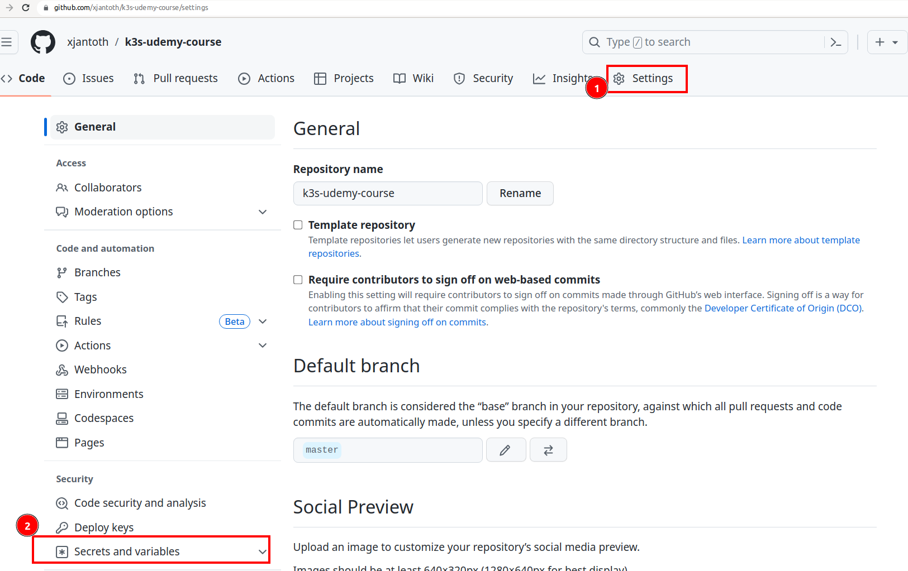
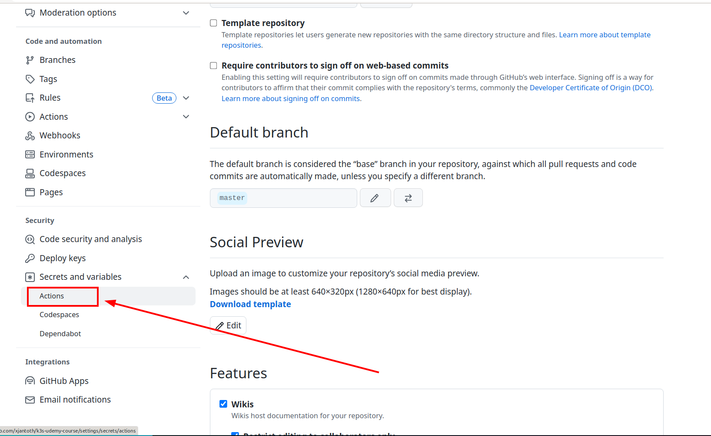
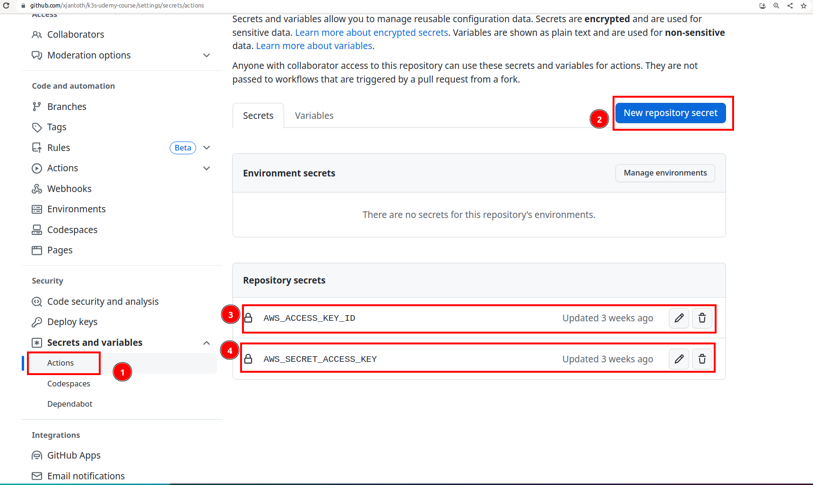

# Github action CICD pipeline to Deploy AWS infrastructure by Terrafrom





#### Github Actions Deploy

```yaml
# apply code
name: K3S course Terraform Plan/Apply

on:
  workflow_dispatch:

jobs:
  terraform-apply:
    runs-on: ubuntu-latest
    env:
      ENVIRONMENT_NAME: dev

    steps:
      - name: Checkout code
        uses: actions/checkout@v2

      - name: Configure AWS credentials
        uses: aws-actions/configure-aws-credentials@master
        with:
          aws-access-key-id: ${{ secrets.AWS_ACCESS_KEY_ID }}
          aws-secret-access-key: ${{ secrets.AWS_SECRET_ACCESS_KEY }}
          aws-region: us-east-1

      - name: Setup Terraform
        uses: hashicorp/setup-terraform@v1
        with:
          terraform_version: 1.4.6

      - name: Terraform Init
        run: cd terraform; pwd; ls -al; terraform init

      - name: Terraform Plan
        run: cd terraform; pwd; ls -al; terraform plan -out=tfplan.out

      - name: Get Approval
        id: approval
        run: |
          echo "Approve or reject the Terraform changes."
          echo "::set-output name=approved::true" # Set to 'false' if rejected

      - name: Terraform Apply
        if: ${{ steps.approval.outputs.approved == 'true' }}
        run: cd terraform; pwd; ls -al; terraform apply tfplan.out
```


#### Terraform Destroy

```bash
# destroy code
name: K3S course - Terraform Destroy

on:
  workflow_dispatch:

jobs:
  terraform-destroy:
    runs-on: ubuntu-latest
    env:
      ENVIRONMENT_NAME: dev

    steps:
      - name: Checkout code
        uses: actions/checkout@v2

      - name: Configure AWS credentials
        uses: aws-actions/configure-aws-credentials@master
        with:
          aws-access-key-id: ${{ secrets.AWS_ACCESS_KEY_ID }}
          aws-secret-access-key: ${{ secrets.AWS_SECRET_ACCESS_KEY }}
          aws-region: us-east-1

      - name: Setup Terraform
        uses: hashicorp/setup-terraform@v1
        with:
          terraform_version: 1.4.6

      - name: Terraform Init
        run: cd terraform; pwd; ls -al; terraform init

      - name: Get Approval
        id: approval
        run: |
          echo "Approve or reject the Terraform changes."
          echo "::set-output name=approved::true" # Set to 'false' if rejected

      - name: Terraform Destroy
        if: ${{ steps.approval.outputs.approved == 'true' }}
        run: cd terraform; ls -al; pwd; terraform destroy -auto-approve

```
