### MFA enforced on CLI level


Setup new directly attached AWS policy to a user `k3s-admin`.
Copy following policy to 

Navigate to `IAM` section and find `k3s-admin` IAM user in AWS web console. Hit `Permissions` -> `Add permissions` -> `Create inline policy`.
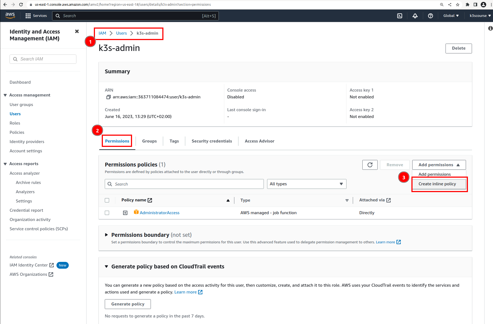

Switch to `JSON` policy view while creating a new one and copy/paste following codeblock.


```json
{
    "Statement": [
        {
            "Condition": {
                "BoolIfExists": {
                    "aws:MultiFactorAuthPresent": "false"
                }
            },
            "Effect": "Deny",
            "NotAction": [
                "sts:GetSessionToken",
                "iam:ResyncMFADevice",
                "iam:ListVirtualMFADevices",
                "iam:ListUsers",
                "iam:ListServiceSpecificCredentials",
                "iam:ListSSHPublicKeys",
                "iam:ListMFADevices",
                "iam:ListAccountAliases",
                "iam:ListAccessKeys",
                "iam:GetAccountSummary",
                "iam:EnableMFADevice",
                "iam:DeleteVirtualMFADevice",
                "iam:CreateVirtualMFADevice"
            ],
            "Resource": "*",
            "Sid": "MustBeSignedInWithMFA"
        }
    ],
    "Version": "2012-10-17"
}

```


Hit `Review policy`
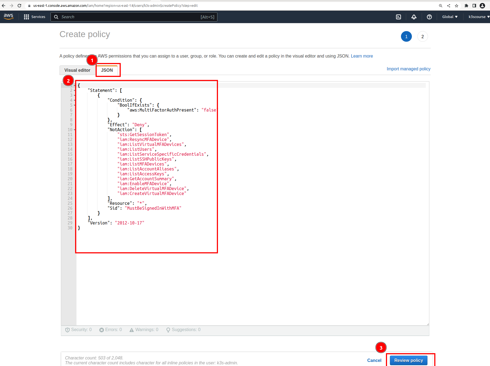


Assign the policy some name e.g. `k3s-admin-ui-cli-with-mfa` and puhs `Create policy`.
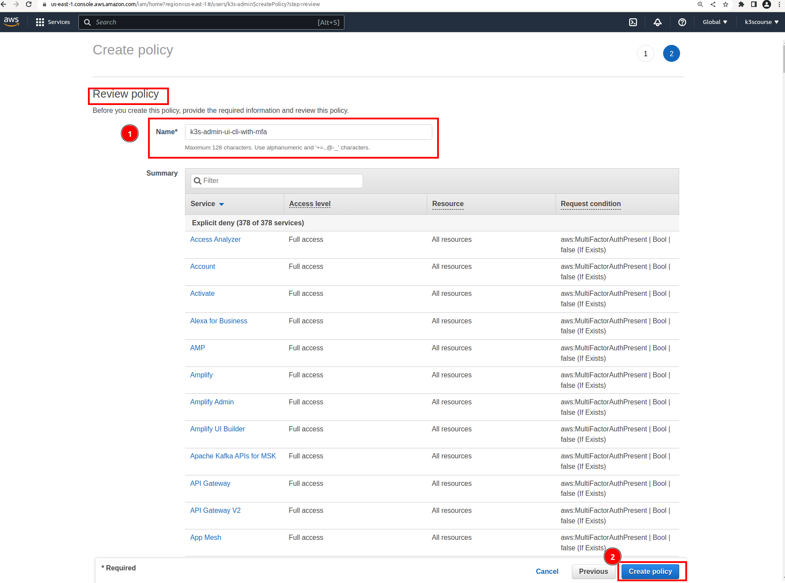


Finally, review `k3s-admin` IAM user. It should have by now two permissions policies:
- `AdministratorAccess`
- `k3s-admin-ui-cli-with-mfa`


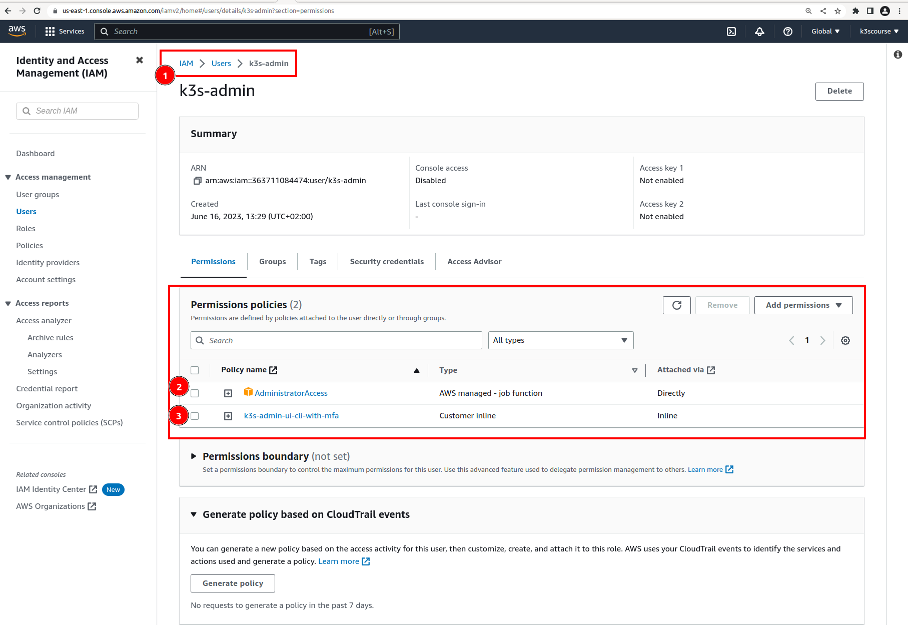


#### Test whether MFA is enforced at both Web UI and CLI level


Generate `Access keys` for `k3s-admin` IAM user first.

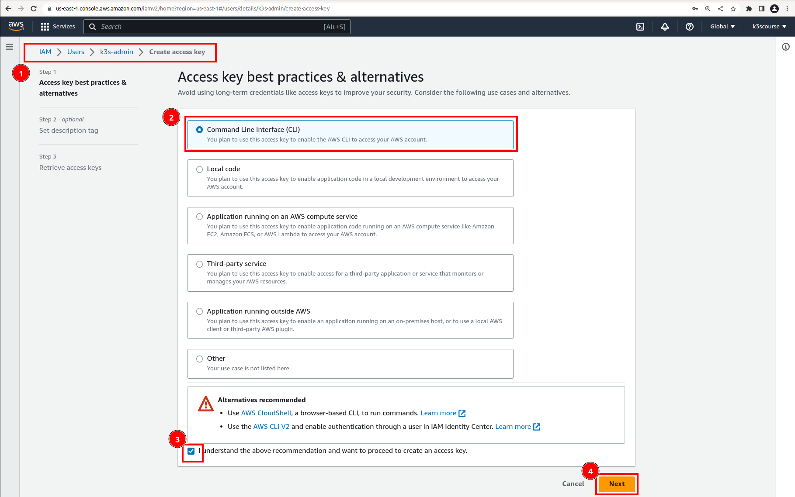
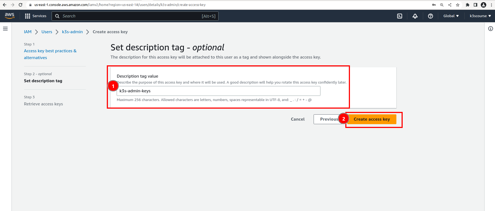
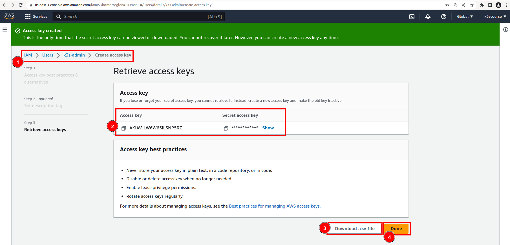

Setup aws cli locally (create a new AWS PROFILE)

```bash
aws configure --profile k3s-admin
```

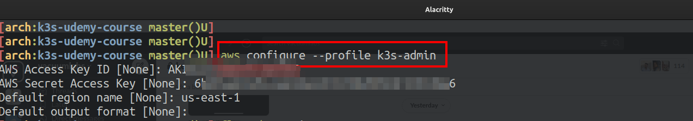


Create a sample Terraform code in a subfolder `test-mfa` for `k3s-admin` user to test MFA at CLI level.

```bash
export AWS_DEFAULT_PROFILE=k3s-admin

env | grep AWS
AWS_DEFAULT_PROFILE=k3s-admin

mkdir -p test-mfa

cat <<EOF > test-mfa/main.tf
provider "aws" {
  region = "us-east-1"
}

resource "aws_instance" "example" {
  ami           = "ami-0c94855ba95c71c99"
  instance_type = "t2.micro"

  tags = {
    Name = "ExampleInstance"
  }
}
EOF

cd test-mfa

# init/plan should go through without any problem
terraform init
terraform plan
terraform apply

  Enter a value: yes

aws_instance.example: Creating...
╷
│ Error: creating EC2 Instance: UnauthorizedOperation: You are not authorized to perform this operation. Encoded authorization failure message: fnWGjUOFSHpsg4YQUytxJHcHOKuProzqIzsuYPfIDS5QRL6q32MhqLWCJ_x5jjiZ5U8_6nYku1vXtHmsIcrnhqPSmZg6FSNVqgbSG0Q2_DGtUkHSw6MQ1wMYCyWEB-MAdKBsf1J9CFXGGAIe1fTJC-uQMSkyzokJlQQOo6HntRl_TiSvRxC4krNqGKb59yqBuhFjY8wZONKa36yBtDq_x_mZMlZAh5-fgMynvBIoaNoTiGAFM9dvTWVg4bawib1T7keJvUqzpQATVDfnG40fNykU7YRTQOO3NMpTr6KpwM5tpAJASjryqV2co8B_wvNCubF4BhVpUa5ZCtRv7rPqJSjN7Y6CfFI0znq5DV0Eploesix_X5Q1ARzlvvqE31rza0ZCnc7j-NFtDoKzfW-rSQdi2idsxUcDmT9EaVKFUibxHBwpT7j7pThE38yAUzVqwgjk0af-hINgaW6rrmxjMKs5PFIiwlFvwVYwIgEAWQ3PMpQQvGdVn1hrSmBZU_KbEI0QML1IE6txXhkqEBUmBDpzhtTj34o7iHKXVeUt8TD7vcGYHcZSGuvV3CjnAI2z0C1h9S7yYndHdEsmHeOaA4rcx_xwR7RInhg_q10DOp3bRh1YiaLnnxm7EZFTZ_msPYLbYanwR1KD6SQJNC1zOYVWPFfdimQnQG9TsbNfvi2xn4EsejhGkJOqEFO2TDN4Ckv9CBwpUmOIOU6MkX-EdN72L4XGFkefKQetrlsTjUM9GPTzLopvgh_-9y_DlxZ2CLmDgI9M4cK7gnTF8KvPUXCNKyXL4Lrne4lrFIAg5Og6vnVtEvRgM9q-1idGhVLCOmNUQ6DKSmxylYHePQcYKIVJmsdMn0i4kzTRFK1MUQZvzbYWuZqmKyjR6C6nNi1hvx1Wq37NRk_-tNiRySXppgsiccOifeTRp25Zvmld41bSVaQT8mh4628A13-7Vg
│       status code: 403, request id: a8d50436-5053-4ab7-94ee-4dbecf412d80
│
│   with aws_instance.example,
│   on main.tf line 5, in resource "aws_instance" "example":
│    5: resource "aws_instance" "example" {
│
╵

```

Decode message by using even stronger credentials (root).

```bash
export AWS_DEFAULT_PROFILE=k3s-root

[arch:jantoth ] aws sts decode-authorization-message --encoded-message fnWGjUOFSHpsg4YQUytxJHcHOKuProzqIzsuYPfIDS5QRL6q32MhqLWCJ_x5jjiZ5U8_6nYku1vXtHmsIcrnhqPSmZg6FSNVqgbSG0Q2_DGtUkHSw6MQ1wMYCyWEB-MAdKBsf1J9CFXGGAIe1fTJC-uQMSkyzokJlQQOo6HntRl_TiSvRxC4krNqGKb59yqBuhFjY8wZONKa36yBtDq_x_mZMlZAh5-fgMynvBIoaNoTiGAFM9dvTWVg4bawib1T7keJvUqzpQATVDfnG40fNykU7YRTQOO3NMpTr6KpwM5tpAJASjryqV2co8B_wvNCubF4BhVpUa5ZCtRv7rPqJSjN7Y6CfFI0znq5DV0Eploesix_X5Q1ARzlvvqE31rza0ZCnc7j-NFtDoKzfW-rSQdi2idsxUcDmT9EaVKFUibxHBwpT7j7pThE38yAUzVqwgjk0af-hINgaW6rrmxjMKs5PFIiwlFvwVYwIgEAWQ3PMpQQvGdVn1hrSmBZU_KbEI0QML1IE6txXhkqEBUmBDpzhtTj34o7iHKXVeUt8TD7vcGYHcZSGuvV3CjnAI2z0C1h9S7yYndHdEsmHeOaA4rcx_xwR7RInhg_q10DOp3bRh1YiaLnnxm7EZFTZ_msPYLbYanwR1KD6SQJNC1zOYVWPFfdimQnQG9TsbNfvi2xn4EsejhGkJOqEFO2TDN4Ckv9CBwpUmOIOU6MkX-EdN72L4XGFkefKQetrlsTjUM9GPTzLopvgh_-9y_DlxZ2CLmDgI9M4cK7gnTF8KvPUXCNKyXL4Lrne4lrFIAg5Og6vnVtEvRgM9q-1idGhVLCOmNUQ6DKSmxylYHePQcYKIVJmsdMn0i4kzTRFK1MUQZvzbYWuZqmKyjR6C6nNi1hvx1Wq37NRk_-tNiRySXppgsiccOifeTRp25Zvmld41bSVaQT8mh4628A13-7Vg
{
    "DecodedMessage": "{\"allowed\":false,\"explicitDeny\":true,\"matchedStatements\":{\"items\":[{\"statementId\":\"MustBeSignedInWithMFA\",\"effect\":\"DENY\",\"principals\":{\"items\":[{\"value\":\"AIDAVJLW6W65F7NXLEPGQ\"}]},\"principalGroups\":{\"items\":[]},\"actions\":{\"items\":[{\"value\":\"sts:GetSessionToken\"},{\"value\":\"iam:ResyncMFADevice\"},{\"value\":\"iam:ListVirtualMFADevices\"},{\"value\":\"iam:ListUsers\"},{\"value\":\"iam:ListServiceSpecificCredentials\"},{\"value\":\"iam:ListSSHPublicKeys\"},{\"value\":\"iam:ListMFADevices\"},{\"value\":\"iam:ListAccountAliases\"},{\"value\":\"iam:ListAccessKeys\"},{\"value\":\"iam:GetAccountSummary\"},{\"value\":\"iam:EnableMFADevice\"},{\"value\":\"iam:DeleteVirtualMFADevice\"},{\"value\":\"iam:CreateVirtualMFADevice\"}]},\"resources\":{\"items\":[{\"value\":\"*\"}]},\"conditions\":{\"items\":[{\"key\":\"aws:MultiFactorAuthPresent\",\"values\":{\"items\":[{\"value\":\"false\"}]}}]}}]},\"failures\":{\"items\":[]},\"context\":{\"principal\":{\"id\":\"AIDAVJLW6W65F7NXLEPGQ\",\"name\":\"k3s-admin\",\"arn\":\"arn:aws:iam::363711084474:user/k3s-admin\"},\"action\":\"ec2:RunInstances\",\"resource\":\"arn:aws:ec2:us-east-1:363711084474:instance/*\",\"conditions\":{\"items\":[{\"key\":\"ec2:InstanceMarketType\",\"values\":{\"items\":[{\"value\":\"on-demand\"}]}},{\"key\":\"aws:Resource\",\"values\":{\"items\":[{\"value\":\"instance/*\"}]}},{\"key\":\"aws:Account\",\"values\":{\"items\":[{\"value\":\"363711084474\"}]}},{\"key\":\"ec2:AvailabilityZone\",\"values\":{\"items\":[{\"value\":\"us-east-1a\"}]}},{\"key\":\"ec2:ebsOptimized\",\"values\":{\"items\":[{\"value\":\"false\"}]}},{\"key\":\"ec2:IsLaunchTemplateResource\",\"values\":{\"items\":[{\"value\":\"false\"}]}},{\"key\":\"ec2:InstanceType\",\"values\":{\"items\":[{\"value\":\"t2.micro\"}]}},{\"key\":\"ec2:RootDeviceType\",\"values\":{\"items\":[{\"value\":\"ebs\"}]}},{\"key\":\"aws:Region\",\"values\":{\"items\":[{\"value\":\"us-east-1\"}]}},{\"key\":\"aws:Service\",\"values\":{\"items\":[{\"value\":\"ec2\"}]}},{\"key\":\"ec2:InstanceID\",\"values\":{\"items\":[{\"value\":\"*\"}]}},{\"key\":\"aws:Type\",\"values\":{\"items\":[{\"value\":\"instance\"}]}},{\"key\":\"ec2:Tenancy\",\"values\":{\"items\":[{\"value\":\"default\"}]}},{\"key\":\"ec2:Region\",\"values\":{\"items\":[{\"value\":\"us-east-1\"}]}},{\"key\":\"aws:ARN\",\"values\":{\"items\":[{\"value\":\"arn:aws:ec2:us-east-1:363711084474:instance/*\"}]}}]}}}"
}

```


Despite the fact that the AWS profile that uses IAM user `k3s-admin` (who has got `AdministrationAccess policy`) enforces MFA at CLI level as well. That's why it's important to somehow use MFA code from a phone `Authenicator app`.

#### Solution


```bash
unset $(echo $(env | grep AWS | cut -d"=" -f1))

TOKEN_CODE="183284"

AWS_ACCOUNT_ID="363711084474"
PROFILE="k3s-admin"
IAM_USER="k3s-admin"

token_output=$(aws sts get-session-token \
--serial-number arn:aws:iam::${AWS_ACCOUNT_ID}:mfa/${IAM_USER} \
--token-code ${TOKEN_CODE} \
--profile ${PROFILE})

# Extract the temporary credentials from the command output
export AWS_ACCESS_KEY_ID=$(echo $token_output | jq -r '.Credentials.AccessKeyId')
export AWS_SECRET_ACCESS_KEY=$(echo $token_output | jq -r '.Credentials.SecretAccessKey')
export AWS_SESSION_TOKEN=$(echo $token_output | jq -r '.Credentials.SessionToken')

# verify that
env | grep AWS

AWS_ACCESS_KEY_ID=ASIAVJLW6W..LSL
AWS_SECRET_ACCESS_KEY=/LaroClDRh....yZJb08gFPglvX6
AWS_SESSION_TOKEN=IQoJb3JpZ2luX2VjEO7//...7bJg+cAYoD4uvZ/eotF9wOs2NDx

# Run terraform code again
terraform init
terraform apply
```
#### Execute terraform code code


Execute `terraform apply` and confirm by typing `yes`

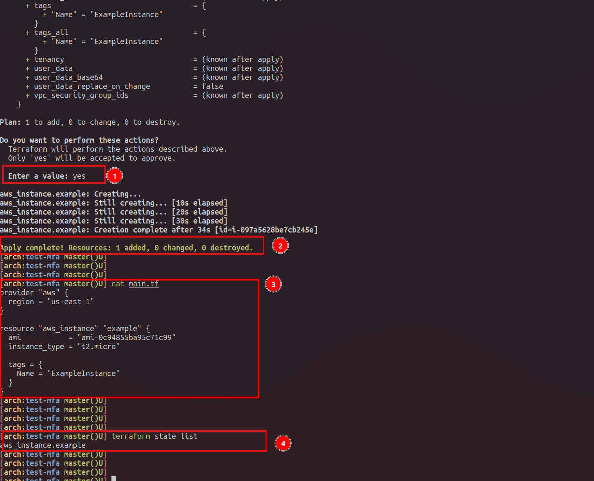


Terraform is reading `AWS_SESSION_TOKEN`, `AWS_ACCESS_KEY_ID` and `AWS_SECRET_ACCESS_KEY` env. variables to connect to AWS and provision a simple EC2 instance.
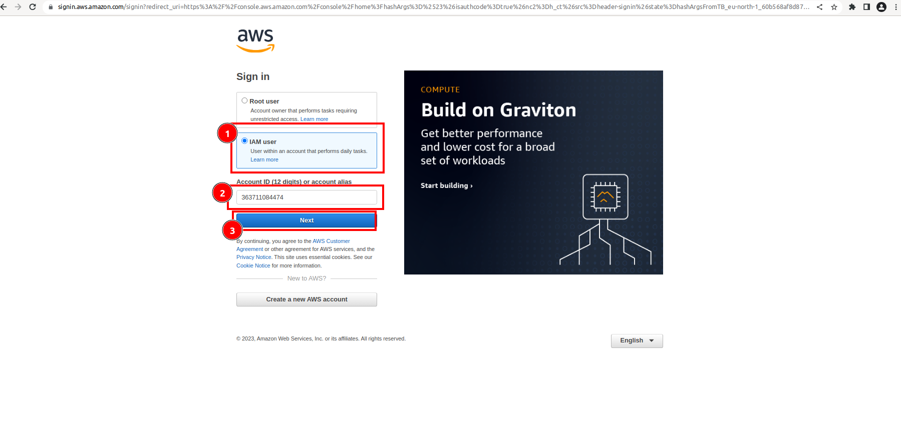

Verify that EC2 was created by logging in to AWS Web Console using `k3s-admin` user, its `password` and MFA code from tour `Authenticator app`.


Verify that instance was created.
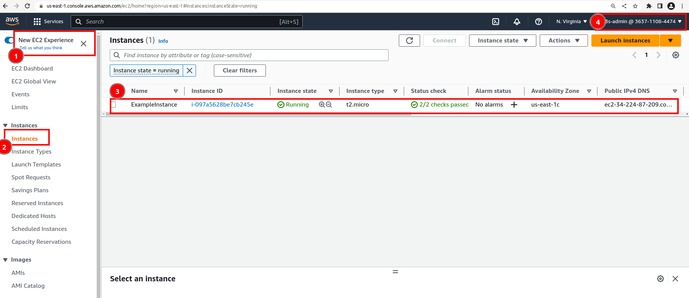


#### Delete this testing EC2 instance


```bash
[arch:test-mfa master()U] terraform destroy

aws_instance.example: Refreshing state... [id=i-097a5628be7cb245e]

Terraform used the selected providers to generate the following execution
plan. Resource actions are indicated with the following symbols:
  - destroy

Terraform will perform the following actions:

  # aws_instance.example will be destroyed
  - resource "aws_instance" "example" {
      - ami                                  = "ami-0c94855ba95c71c99" -> null
      - arn                                  = "arn:aws:ec2:us-east-1:363711084474:instance/i-097a5628be7cb245e" -> null
      - associate_public_ip_address          = true -> null
      - availability_zone                    = "us-east-1c" -> null
      ...
          - tags                  = {} -> null
          - throughput            = 0 -> null
          - volume_id             = "vol-07d15add1c27f995f" -> null
          - volume_size           = 8 -> null
          - volume_type           = "gp2" -> null
        }
    }

Plan: 0 to add, 0 to change, 1 to destroy.

Do you really want to destroy all resources?
  Terraform will destroy all your managed infrastructure, as shown above.
  There is no undo. Only 'yes' will be accepted to confirm.

  Enter a value: yes

aws_instance.example: Destroying... [id=i-097a5628be7cb245e]
aws_instance.example: Still destroying... [id=i-097a5628be7cb245e, 10s elapsed]
aws_instance.example: Still destroying... [id=i-097a5628be7cb245e, 21s elapsed]
aws_instance.example: Still destroying... [id=i-097a5628be7cb245e, 31s elapsed]
aws_instance.example: Destruction complete after 32s

Destroy complete! Resources: 1 destroyed.

```

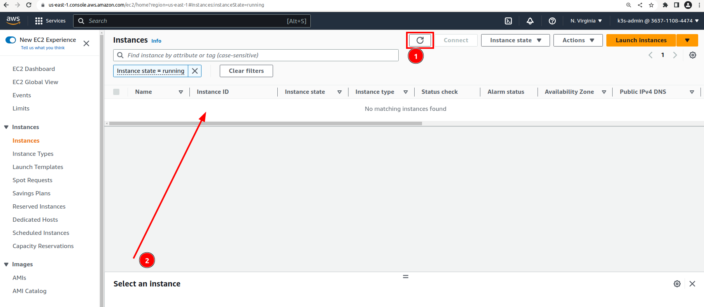
