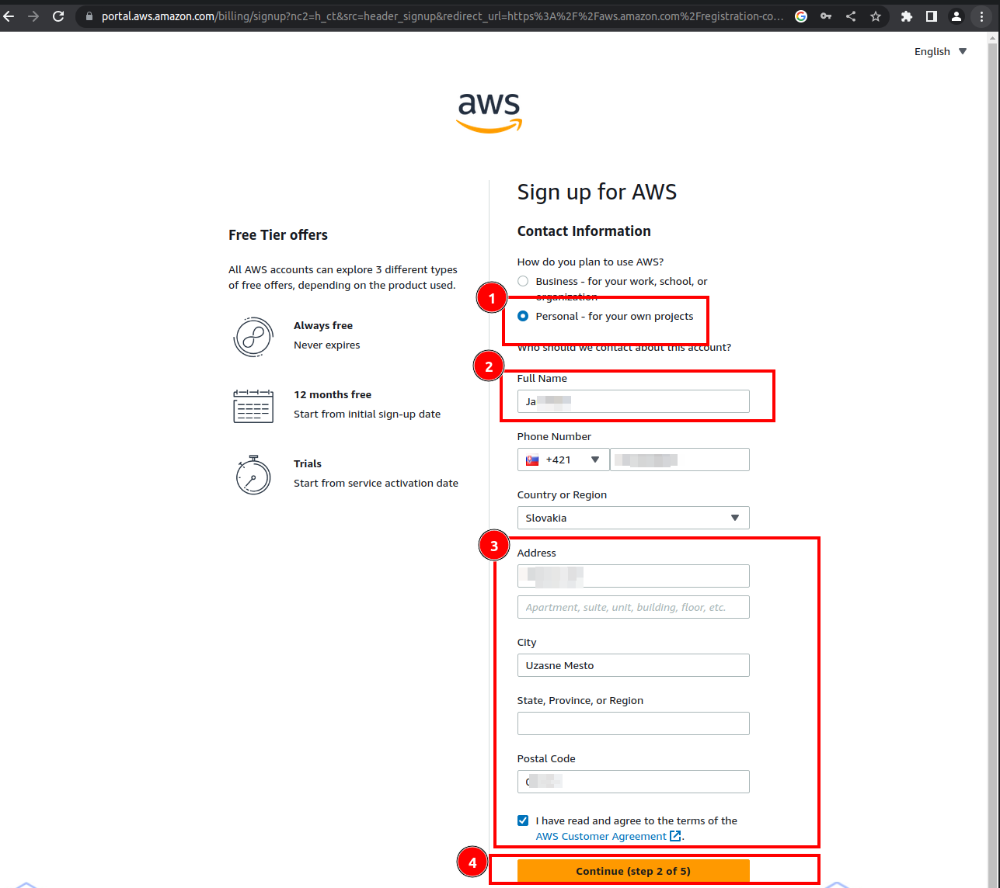
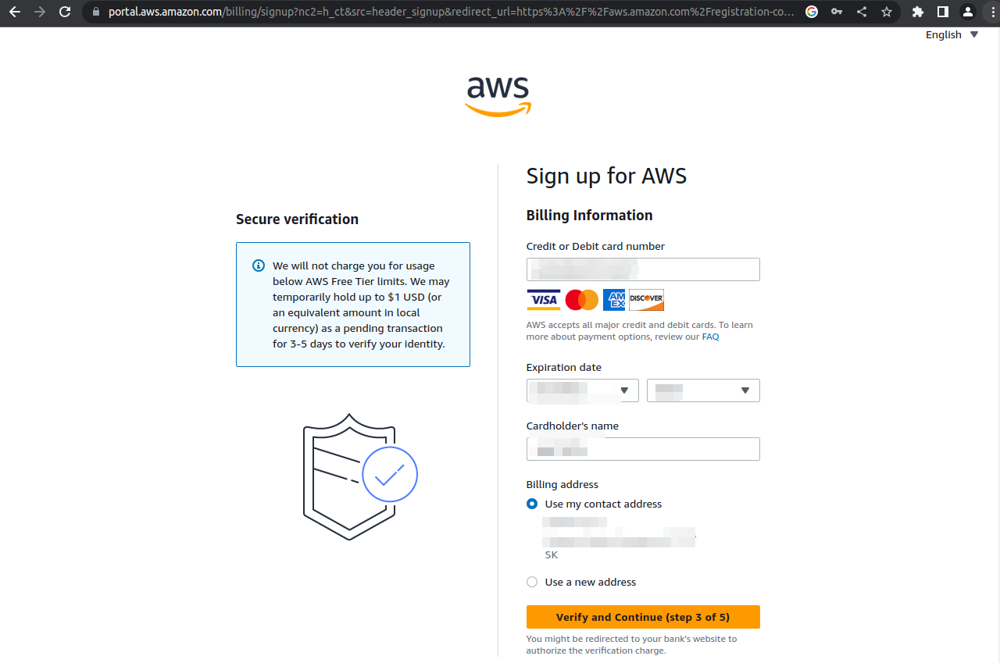
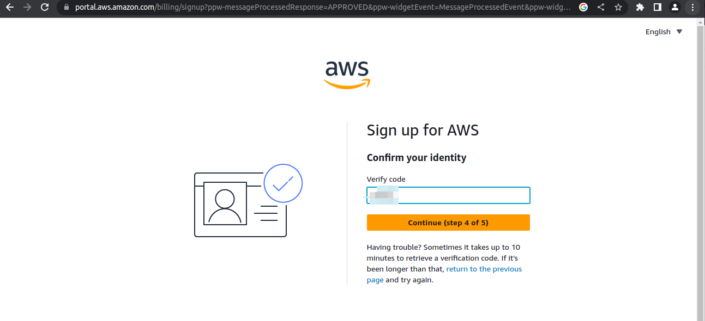
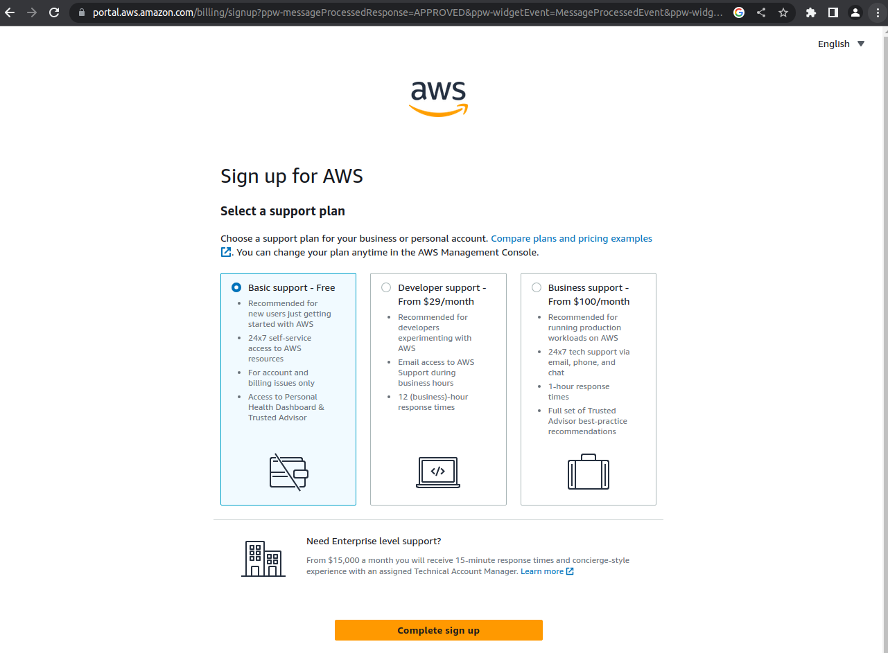
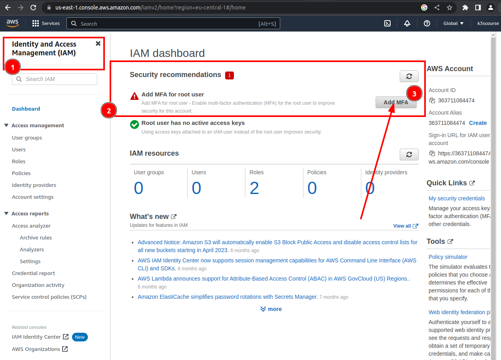
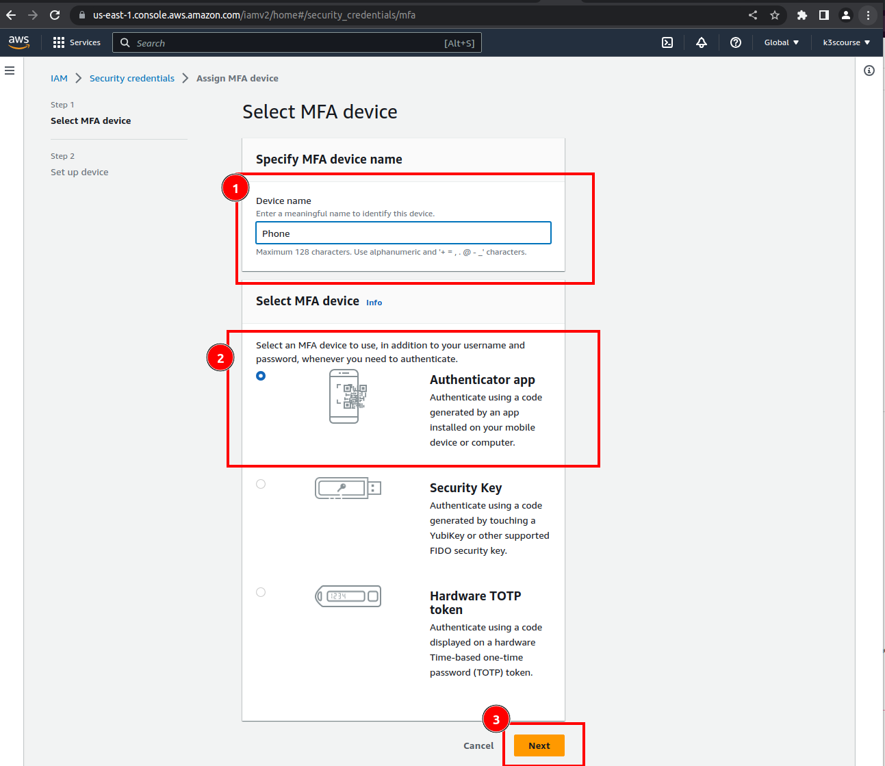

### Setting up AWS Free Tier account

Google "How to create Free Tier AWS account" and use some email address. I would advise to create an email address dedicated for this course.

Verification code will be sent to the respective mailbox once email address was written to a "Sign up for AWS" page

Provide root password. Make sure it is strong enough and save it safely e.g. keepass.

Choose "Personal - for your own projects"

Enter Bank Account data. However, one should not be charged a penny since Free Tier AWS account will be used.

"Text message (SMS)"

Confirm your identity

Choose "Basic support - Free" option.

Congratulations.

Choose "Root user". Sign in with your email address and previoulsy specified password.

Type password.

Setup MFA authentication

Setup MFA authentication

Select MFA device. I would recommend to download "Google Authenticator App" to your cell phone.

Open "Google Authenticator App", hit Plus sign and scan QR code.

You are all set when it comes to so called "root AWS account user"

