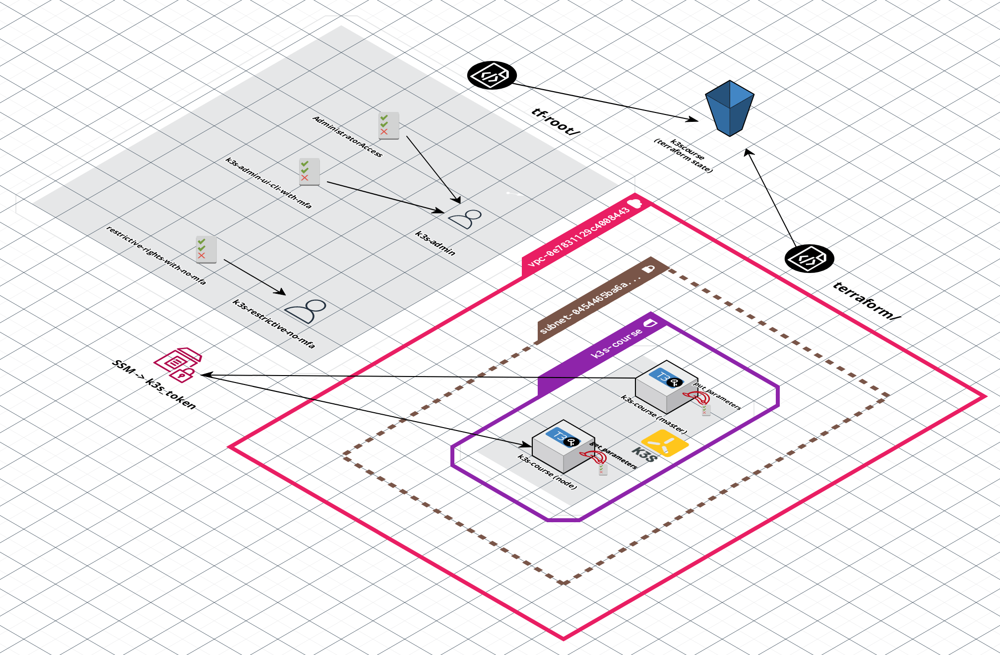
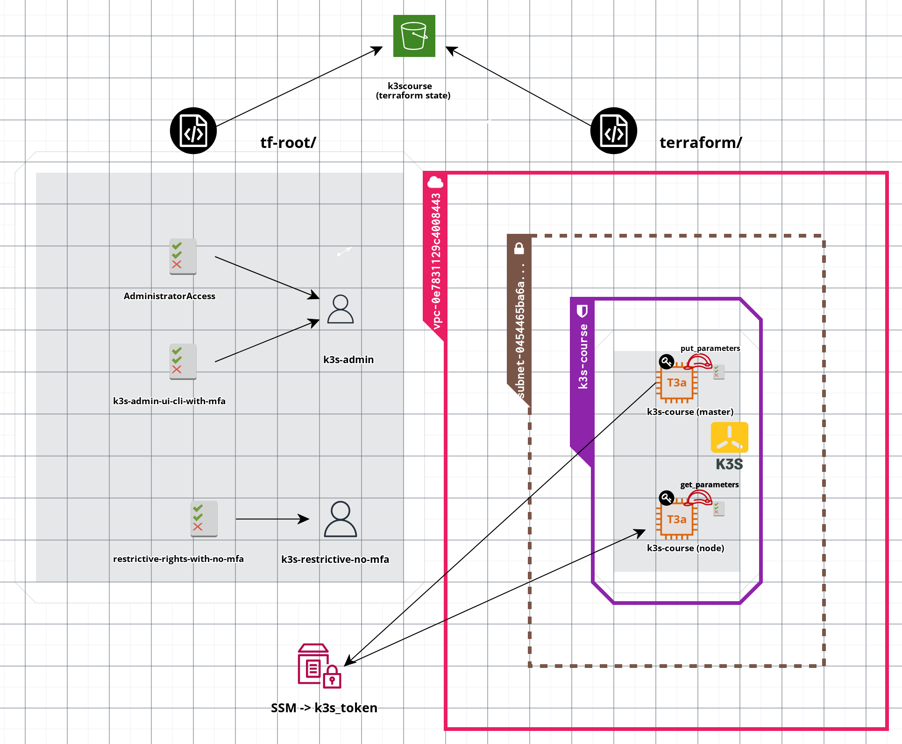

### Writing terraform code for 2 AWS EC2 instances

#### Target AWS infrastructure deployed to be by Terrafrom

<!--  -->




#### Finding proper AMI imagee

```bash
[arch:terraform master()U] aws ssm get-parameters --names /aws/service/canonical/ubuntu/server/20.04/stable/current/amd64/hvm/ebs-gp2/ami-id
{
    "Parameters": [
        {
            "Name": "/aws/service/canonical/ubuntu/server/20.04/stable/current/amd64/hvm/ebs-gp2/ami-id",
            "Type": "String",
            "Value": "ami-0efd657a42099f98f",
            "Version": 273,
            "LastModifiedDate": "2023-06-03T01:45:16.166000+02:00",
            "ARN": "arn:aws:ssm:us-east-1::parameter/aws/service/canonical/ubuntu/server/20.04/stable/current/amd64/hvm/ebs-gp2/ami-id",
            "DataType": "aws:ec2:image"
        }
    ],
    "InvalidParameters": []
}

```
